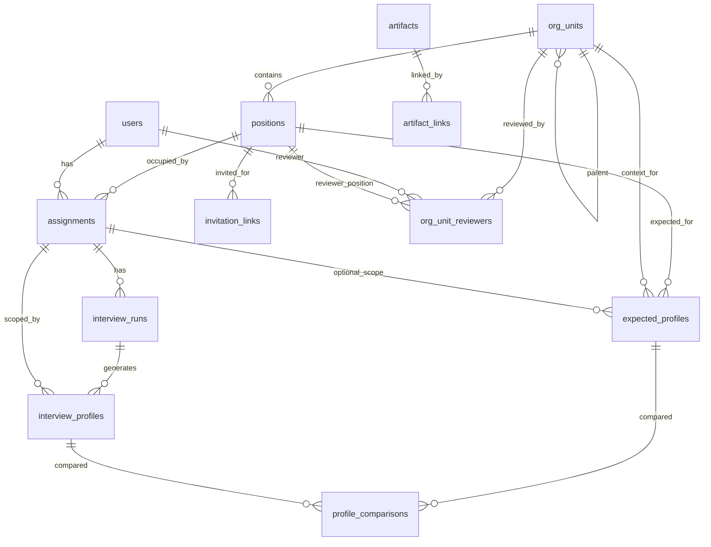

# База данных и доменная модель

Этот документ описывает фактическую Postgres-схему проекта после миграции
`db/migrations/001_initial_core_schema.sql` и правила работы с данными.

Главный принцип системы:

```text
User -> Assignment -> Position -> OrgUnit
Assignment -> InterviewRun -> InterviewProfile
Artifact -> ArtifactLink -> ExpectedProfile
ExpectedProfile + InterviewProfile -> ProfileComparison
```

`Assignment` является центральным контекстом интервью. Не привязывайте интервью
только к пользователю или только к должности: один пользователь может занимать
несколько должностей, а одну должность могут занимать несколько пользователей.

## Источник схемы

Актуальная миграция:

```text
db/migrations/001_initial_core_schema.sql
```

Применение миграций:

```bash
uv run python scripts/apply_migrations.py
```

Импорт оргструктуры, должностей, ставок и артефактов:

```bash
uv run python scripts/import_staffing_xlsx.py data/staffing_with_artifact_text_links.xlsx
```

Dry-run импорта:

```bash
uv run python scripts/import_staffing_xlsx.py --dry-run data/staffing_with_artifact_text_links.xlsx
```

## ER-схема



`artifact_links` использует polymorphic target:

```text
target_type = 'position' -> target_id = positions.id
target_type = 'org_unit' -> target_id = org_units.id
```

Эта связь не выражена внешним ключом на уровне Postgres, потому что один столбец
`target_id` может ссылаться на разные таблицы.

## Таблицы

### `org_units`

Иерархия организационной структуры.

Поля:

- `id uuid` - внутренний идентификатор.
- `parent_id uuid nullable` - ссылка на родительский `org_units.id`.
- `name text` - название конкретного узла.
- `full_path text` - полный путь от корня до узла.
- `level integer` - уровень в дереве, начиная с 1.
- `created_at`, `updated_at`.

Ограничения:

- `full_path` уникален.
- `(parent_id, name)` уникален через индекс.

Правила:

- Само `name` не уникально глобально. Например, одинаковые названия отделов
  могут встречаться в разных ветках.
- Уникальный бизнес-смысл узла задается его положением в дереве, то есть
  `full_path` или пара `(parent_id, name)`.
- Внешние Excel ID оргструктуры в БД не сохраняются. Импортер использует их
  только внутри запуска для сопоставления артефактов.

### `positions`

Формальная должность внутри конкретной оргединицы.

Поля:

- `id uuid`.
- `org_unit_id uuid` - ссылка на `org_units.id`.
- `title text` - название должности.
- `planned_fte numeric(8,2)` - ставок по штатному расписанию.
- `occupied_fte numeric(8,2)` - занятых ставок.
- `is_supervisor boolean` - является ли должность руководящей.
- `is_active boolean`.
- `created_at`, `updated_at`.

Ограничения:

- `(org_unit_id, title)` уникален.

Правила:

- Название должности не уникально глобально.
- Уникальная должность в системе: `org_unit_id + title`.
- Ставки импортируются с точностью до сотых.
- Точные дубликаты строк штатного расписания перед импортом удаляются.
- Несколько неидентичных строк штатного расписания для одной должности
  агрегируются суммой в `planned_fte` и `occupied_fte`.
- Флаги `can_inspect_subordinate_results` и
  `has_direct_supervisor_mapping` из Excel не сохраняются.
- Внешние Excel ID должностей в БД не сохраняются.

### `users`

Люди и учетные записи системы.

Поля:

- `id uuid`.
- `email text` - уникальный email.
- `full_name text`.
- `role text` - `employee`, `manager`, `hr`, `moderator`, `admin`.
- `is_active boolean`.
- `created_at`, `updated_at`.

Пользователи не импортируются из штатного Excel. Они появляются динамически:
например, когда сотрудник открывает invitation link и вводит корпоративный
email и ФИО.

### `assignments`

Конкретное назначение пользователя на должность.

Поля:

- `id uuid`.
- `user_id uuid` - ссылка на `users.id`.
- `position_id uuid` - ссылка на `positions.id`.
- `rate numeric(8,2) nullable` - ставка конкретного назначения.
- `is_active boolean`.
- `created_at`, `updated_at`.

Ограничения:

- Не может быть двух активных назначений для одной пары
  `user_id + position_id`.

Правила:

- `assignments` не создаются из агрегированных ставок штатного расписания.
- `occupied_fte` в `positions` показывает занятые ставки агрегатом, но не
  конкретных сотрудников.

### `invitation_links`

Временный MVP-механизм доступа сотрудника к анкете по должности.

Поля:

- `id uuid`.
- `position_id uuid`.
- `token_hash text` - хранится только хеш токена, не raw token.
- `status text` - `active`, `expired`, `revoked`.
- `max_uses integer nullable`.
- `used_count integer`.
- `expires_at timestamptz nullable`.
- `created_by_user_id uuid nullable`.
- `created_at`, `revoked_at`.

Ожидаемый поток:

```text
InvitationLink -> User find/create -> Assignment find/create -> InterviewRun
```

Web API принимает raw token только из URL, хеширует его SHA-256 и ищет
`invitation_links.token_hash`. При успешном старте анкеты создаётся или
открывается `InterviewRun`, а `interview_runs.id` используется как
`profileId` в текущем answer payload. Это сохраняет существующий JSON-контракт
и одновременно привязывает анкету к доменной цепочке `Assignment`.

### `interview_runs`

Конкретное заполнение анкеты по назначению.

Поля:

- `id uuid`.
- `assignment_id uuid`.
- `status text` - `not_started`, `in_progress`, `submitted`.
- `answers_json jsonb`.
- `started_at`, `last_saved_at`, `submitted_at`.
- `created_at`, `updated_at`.

Правила:

- После `submitted` сотрудник не должен редактировать интервью в MVP.
- Ответы хранятся как JSON, потому что анкета data-driven.
- Текущий web MVP сохраняет в `answers_json` полный answer payload из
  `apps/web/src/schemas/answerPayload.ts`: `profileId`, `currentQuestionId`,
  `updatedAt`, необязательный `submittedAt` и `answers`.
- Пока invitation/auth-flow не реализован, web API может сохранять черновики в
  `interview_runs` только если задан `WEB_MVP_ASSIGNMENT_ID`. Это переходный
  режим; после реализации входа по ссылке `Assignment` должен создаваться или
  находиться до открытия анкеты.

### `artifacts`

Документы-источники для expected profile.

Поля:

- `id uuid`.
- `artifact_type text` -
  `job_instruction`, `org_unit_regulation`, `prof_standard_future`, `other`.
- `title text`.
- `source_file_path text`.
- `source_file_name text`.
- `cleaned_text text`.
- `status text` - `ready`, `needs_review`, `archived`, `failed`.
- `created_at`, `updated_at`.

Ограничения:

- `(source_file_path, source_file_name)` уникален.

Правила:

- Excel `department_regulation` импортируется как `org_unit_regulation`.
- Текстовые чанки Excel `text_chunk_0`, `text_chunk_1`, ... склеиваются в
  `cleaned_text`.
- YAML/frontmatter в начале документа сохраняется как часть `cleaned_text`.
- Внешние Excel `artifact_id` в БД не сохраняются.
- Один документ может иметь несколько связей в `artifact_links`.

### `artifact_links`

Связи документов с доменными сущностями.

Поля:

- `id uuid`.
- `artifact_id uuid`.
- `target_type text` - сейчас используется `position` или `org_unit`.
- `target_id uuid` - ID целевой сущности.
- `relation_type text` - сейчас используется `describes` или `regulates`.
- `link_confidence numeric(4,2)` - уверенность автоматического связывания.
- `review_status text` - `auto_accepted`, `needs_review`, `rejected`.
- `created_at`, `updated_at`.

Ограничения:

- `(artifact_id, target_type, target_id, relation_type)` уникален.

Правила:

- `target_type = 'position'` и `relation_type = 'describes'` для должностных
  инструкций.
- `target_type = 'org_unit'` и `relation_type = 'regulates'` для положений о
  подразделениях.
- Если `link_confidence < 0.75`, импорт ставит `review_status = 'needs_review'`.
- Если `link_confidence >= 0.75`, импорт ставит
  `review_status = 'auto_accepted'`.
- Поле `is_primary` намеренно не используется: несколько артефактов для одной
  должности или оргединицы равноправны.

### `expected_profiles`

Ожидаемый профиль, сгенерированный из документов и оргконтекста.

Поля:

- `id uuid`.
- `position_id uuid`.
- `org_unit_id uuid`.
- `assignment_id uuid nullable`.
- `profile_json jsonb`.
- `status text` - `pending`, `generated`, `failed`, `stale`.
- `is_current boolean`.
- `created_at`, `updated_at`.

Правила:

- В MVP expected profile обычно строится для `position_id + org_unit_id`.
- `assignment_id` nullable и оставлен для будущих assignment-specific профилей.
- При регенерации старый профиль должен получить `is_current = false`, новый -
  `is_current = true`.

### `interview_profiles`

Профиль, сгенерированный из конкретного интервью.

Поля:

- `id uuid`.
- `interview_run_id uuid`.
- `assignment_id uuid`.
- `profile_json jsonb`.
- `status text` - `pending`, `generated`, `failed`, `stale`.
- `is_current boolean`.
- `created_at`, `updated_at`.

Правила:

- Это именно `InterviewProfile`, не `ActualProfile`: профиль отражает ответы
  интервью, а не абсолютную фактическую истину.

### `profile_comparisons`

Сохраненный результат сравнения expected profile и interview profile.

Поля:

- `id uuid`.
- `expected_profile_id uuid`.
- `interview_profile_id uuid`.
- `interview_run_id uuid`.
- `assignment_id uuid`.
- `result_json jsonb`.
- `status text` - `pending`, `generated`, `failed`, `stale`.
- `created_at`, `updated_at`.

Ожидаемая структура `result_json`:

```json
{
  "matches": [],
  "differences": [],
  "conflicts": [],
  "missing_in_interview": [],
  "extra_in_interview": [],
  "severity": "medium",
  "explanation": "...",
  "needs_review": true
}
```

### `org_unit_reviewers`

Правила видимости интервью и сравнений для менеджеров, HR и наблюдателей.

Поля:

- `id uuid`.
- `org_unit_id uuid`.
- `reviewer_user_id uuid nullable`.
- `reviewer_position_id uuid nullable`.
- `reviewer_role text` - `manager`, `deputy`, `hr_partner`, `observer`.
- `include_child_units boolean`.
- `can_view_interviews boolean`.
- `can_view_comparisons boolean`.
- `created_at`.

Ограничение:

- Должен быть заполнен хотя бы один из `reviewer_user_id` или
  `reviewer_position_id`.

## Импорт из Excel

Источник:

```text
data/staffing_with_artifact_text_links.xlsx
```

Листы:

- `position_supervisor_flags` - оргструктура, должности, ставки и
  `is_supervisor`.
- `artifact_text_flat` - артефакты, чанки текста и связи с должностями или
  оргединицами.

Импортер:

```text
scripts/import_staffing_xlsx.py
```

Поведение импорта:

- делает upsert существующих сущностей;
- не хранит внешние Excel ID в БД;
- использует Excel ID только как временный mapping внутри запуска;
- удаляет точные дубликаты строк штатки;
- строит полное дерево `org_units` по уровням 1-5;
- агрегирует ставки в `positions`;
- создает равноправные `artifact_links`;
- обновляет `planned_fte`, `occupied_fte`, `is_supervisor`, `cleaned_text`,
  `link_confidence`, `review_status` при повторном запуске.

Ожидаемая dry-run сводка для текущего workbook:

```text
raw staffing rows: 4667
exact staffing duplicates removed: 86
raw artifact/link rows: 294
org_units to upsert: 1119
positions to upsert: 4067
artifacts to upsert: 292
artifact_links to upsert: 294
position artifact links: 178
org_unit artifact links: 116
links needing review: 83
confidence threshold: 0.75
```

`292` артефакта при `294` связях нормально: один source-файл может быть связан
с несколькими целями.

## Частые SQL-запросы

### Дерево оргструктуры

```sql
SELECT
  child.id,
  child.name,
  child.full_path,
  child.level,
  parent.name AS parent_name
FROM org_units child
LEFT JOIN org_units parent ON parent.id = child.parent_id
ORDER BY child.full_path;
```

### Должности в подразделении

```sql
SELECT
  p.id,
  p.title,
  p.planned_fte,
  p.occupied_fte,
  p.is_supervisor
FROM positions p
JOIN org_units ou ON ou.id = p.org_unit_id
WHERE ou.full_path = $1
ORDER BY p.title;
```

### Позиция с оргпутем

```sql
SELECT
  p.id AS position_id,
  p.title,
  p.planned_fte,
  p.occupied_fte,
  p.is_supervisor,
  ou.id AS org_unit_id,
  ou.full_path
FROM positions p
JOIN org_units ou ON ou.id = p.org_unit_id
WHERE p.id = $1;
```

### Артефакты должности

```sql
SELECT
  a.id,
  a.artifact_type,
  a.title,
  a.source_file_path,
  al.link_confidence,
  al.review_status
FROM artifact_links al
JOIN artifacts a ON a.id = al.artifact_id
WHERE al.target_type = 'position'
  AND al.target_id = $1
ORDER BY al.review_status DESC, al.link_confidence DESC, a.title;
```

### Артефакты оргединицы

```sql
SELECT
  a.id,
  a.artifact_type,
  a.title,
  a.source_file_path,
  al.link_confidence,
  al.review_status
FROM artifact_links al
JOIN artifacts a ON a.id = al.artifact_id
WHERE al.target_type = 'org_unit'
  AND al.target_id = $1
ORDER BY al.review_status DESC, al.link_confidence DESC, a.title;
```

### Все документы для expected profile позиции

Берутся должностные инструкции самой позиции и положения ее оргединицы.

```sql
SELECT
  a.id,
  a.artifact_type,
  a.title,
  a.cleaned_text,
  al.target_type,
  al.link_confidence,
  al.review_status
FROM positions p
JOIN org_units ou ON ou.id = p.org_unit_id
JOIN artifact_links al
  ON (
    (al.target_type = 'position' AND al.target_id = p.id)
    OR
    (al.target_type = 'org_unit' AND al.target_id = ou.id)
  )
JOIN artifacts a ON a.id = al.artifact_id
WHERE p.id = $1
  AND al.review_status <> 'rejected'
ORDER BY al.target_type, al.link_confidence DESC;
```

### Активные назначения пользователя

```sql
SELECT
  a.id AS assignment_id,
  a.rate,
  u.email,
  u.full_name,
  p.id AS position_id,
  p.title,
  ou.full_path
FROM assignments a
JOIN users u ON u.id = a.user_id
JOIN positions p ON p.id = a.position_id
JOIN org_units ou ON ou.id = p.org_unit_id
WHERE u.email = $1
  AND a.is_active;
```

### Текущие профили и сравнения по assignment

```sql
SELECT
  ir.id AS interview_run_id,
  ir.status AS interview_status,
  ip.id AS interview_profile_id,
  ep.id AS expected_profile_id,
  pc.id AS comparison_id,
  pc.status AS comparison_status
FROM interview_runs ir
LEFT JOIN interview_profiles ip
  ON ip.interview_run_id = ir.id
  AND ip.is_current
LEFT JOIN assignments ass ON ass.id = ir.assignment_id
LEFT JOIN positions p ON p.id = ass.position_id
LEFT JOIN expected_profiles ep
  ON ep.position_id = p.id
  AND ep.is_current
LEFT JOIN profile_comparisons pc
  ON pc.interview_run_id = ir.id
  AND pc.interview_profile_id = ip.id
  AND pc.expected_profile_id = ep.id
WHERE ir.assignment_id = $1
ORDER BY ir.created_at DESC;
```

## Важные ограничения для агентов

- Не создавайте `assignments` из `positions.occupied_fte`.
- Не ищите Excel source IDs в БД: они намеренно не сохраняются.
- Не вызывайте OpenAI API из фронтенда.
- Не пишите LLM-результаты в БД без JSON-валидации.
- Не используйте `artifact_links.target_id` без фильтра по `target_type`.
- Для expected profile не ограничивайтесь только должностной инструкцией:
  учитывайте также положение оргединицы.
- При регенерации профиля сохраняйте историю через `is_current`, а не
  перезаписывайте старый профиль.
